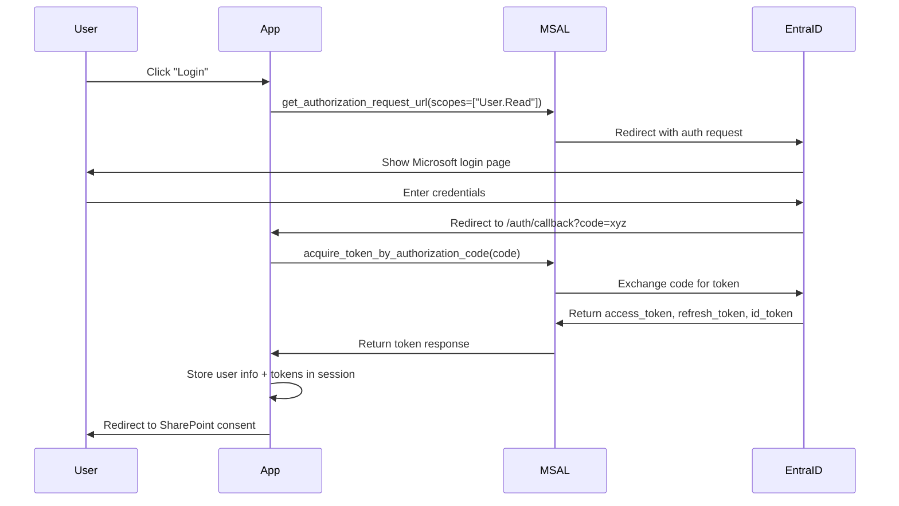
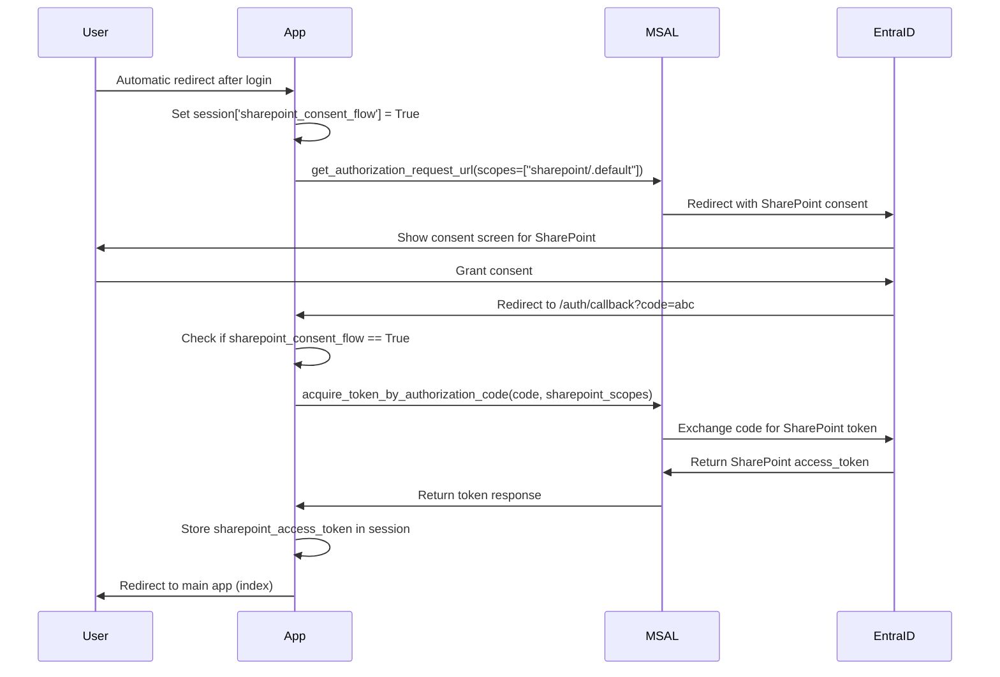
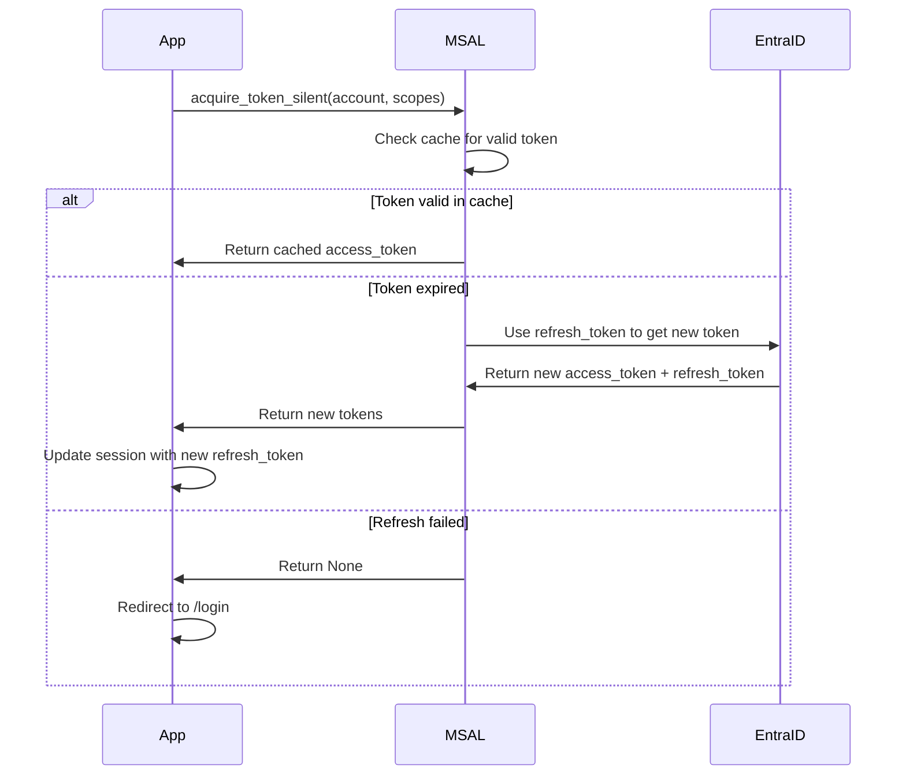

# Authentication Context - Cash Forecast Analyzer

**Document Purpose**: This document captures the complete authentication implementation from the Cash Forecast Analyzer project. It serves as the reference for extracting authentication logic into a reusable Azure Function-based authentication service.

**Date Created**: December 19, 2025  
**Source Project**: cash-forecast-analyzer  
**Target Project**: peakmade-auth-service (to be created)

---

## Table of Contents
1. [Overview](#overview)
2. [Architecture](#architecture)
3. [Azure AD App Registration](#azure-ad-app-registration)
4. [Environment Configuration](#environment-configuration)
5. [Authentication Flow](#authentication-flow)
6. [Code Implementation](#code-implementation)
7. [Session Management](#session-management)
8. [SharePoint Integration](#sharepoint-integration)
9. [Security Considerations](#security-considerations)
10. [Migration Path](#migration-path)

---

## Overview

### What We Built
A complete OAuth 2.0 authentication system using Microsoft Entra ID (Azure AD) with:
- User authentication via MSAL (Microsoft Authentication Library)
- Delegated permissions for Microsoft Graph API
- Delegated permissions for SharePoint Online
- Server-side session management with Flask-Session
- Token caching and refresh logic
- Login/logout flows with proper SSO cleanup

### Why We Built It This Way
- **Delegated Permissions**: Users authenticate as themselves, not as a service principal
- **SharePoint Access**: Required separate consent flow due to scope limitations
- **Session Storage**: File-based sessions prevent cookie overflow (tokens are large)
- **Token Refresh**: MSAL handles automatic token refresh using refresh tokens

### Technologies Used
- **MSAL**: `msal==1.26.0` - Microsoft Authentication Library for Python
- **Flask-Session**: `Flask-Session==0.8.0` - Server-side session storage
- **Flask**: `Flask==3.0.0` - Web framework
- **Office365-REST-Python-Client**: `Office365-REST-Python-Client==2.5.3` - SharePoint API client

---

## Architecture

### Current Architecture (Monolithic)
```
User Browser
    ↓
Flask App (app.py)
    ↓
services/auth.py (AzureADAuth class)
    ↓
MSAL Library
    ↓
Microsoft Entra ID
    ↓ (returns tokens)
Flask Session Storage
    ↓
Protected Routes (require @login_required decorator)
```

### Target Architecture (Microservice)
```
Client Apps (Cash Forecast, Others)
    ↓ HTTP Request
Azure Function App (Auth Service)
    ├── /api/auth/login
    ├── /api/auth/callback
    ├── /api/auth/validate
    ├── /api/auth/refresh
    ├── /api/auth/userinfo
    └── /api/auth/logout
    ↓
MSAL Library
    ↓
Microsoft Entra ID
    ↓ (returns tokens)
Azure Key Vault (token storage)
    ↓
Returns JWT to client app
```

---

## Azure AD App Registration

### App Registration Details
**Name**: Cash Forecast Analyzer (or similar)  
**Platform**: Web application  
**Tenant**: PeakMade organization tenant

### API Permissions Configured
1. **Microsoft Graph**
   - `User.Read` (Delegated) - Read user profile
   - Status: Granted, consented

2. **SharePoint**
   - `https://peakcampus.sharepoint.com/.default` (Delegated)
   - Status: Granted, requires separate consent flow
   - Reason: Cannot be combined with Graph scopes in single auth request

### Redirect URIs
- **Local Development**: `http://localhost:5000/auth/callback`
- **Production**: `https://<your-app>.azurewebsites.net/auth/callback`
- **Future Auth Service**: `https://<auth-service>.azurewebsites.net/api/auth/callback`

### Authentication Configuration
- **Client ID**: From Azure AD app registration (public)
- **Client Secret**: Generated secret (confidential, stored in Key Vault)
- **Tenant ID**: PeakMade organization tenant ID
- **Authority**: `https://login.microsoftonline.com/<tenant-id>`

### Token Configuration
- **Access Token Format**: JWT
- **Token Version**: v2.0
- **ID Token**: Included (contains user claims)
- **Refresh Token**: Enabled

---

## Environment Configuration

### Required Environment Variables
```bash
# Azure AD Authentication
AZURE_AD_CLIENT_ID=<your-client-id>
AZURE_AD_CLIENT_SECRET=<your-client-secret>
AZURE_AD_TENANT_ID=<your-tenant-id>
AZURE_AD_REDIRECT_URI=http://localhost:5000/auth/callback  # or production URL

# SharePoint Configuration
SHAREPOINT_SITE_URL=https://peakcampus.sharepoint.com/sites/BaseCampApps

# Flask Session
SECRET_KEY=<strong-random-key>  # Used for signing session cookies
SESSION_TYPE=filesystem  # Store sessions on disk, not in cookies
```

### Local Development (.env file)
Create a `.env` file in project root (never commit this):
```bash
AZURE_AD_CLIENT_ID=your-client-id
AZURE_AD_CLIENT_SECRET=your-secret
AZURE_AD_TENANT_ID=your-tenant-id
AZURE_AD_REDIRECT_URI=http://localhost:5000/auth/callback
SHAREPOINT_SITE_URL=https://peakcampus.sharepoint.com/sites/BaseCampApps
SECRET_KEY=dev-secret-key-change-in-production
```

### Production Configuration (Azure App Service)
Set as Application Settings in Azure Portal:
- Navigate to Azure App Service → Configuration → Application Settings
- Add each variable as a new application setting
- Use Azure Key Vault references for secrets: `@Microsoft.KeyVault(SecretUri=...)`

---

## Authentication Flow

### Initial Login Flow


### SharePoint Consent Flow


### Token Refresh Flow


### Logout Flow
```
1. User clicks "Logout"
2. App clears Flask session (all tokens removed)
3. App redirects to Azure AD logout endpoint
4. Azure AD clears SSO session
5. Azure AD redirects back to app homepage (unauthenticated)
```

---

## Code Implementation

### Core Authentication Class (`services/auth.py`)

```python
class AzureADAuth:
    """Handle Azure AD OAuth authentication flows"""
    
    def __init__(self, app=None):
        self.client_id = os.environ.get('AZURE_AD_CLIENT_ID')
        self.client_secret = os.environ.get('AZURE_AD_CLIENT_SECRET')
        self.tenant_id = os.environ.get('AZURE_AD_TENANT_ID')
        self.authority = f"https://login.microsoftonline.com/{self.tenant_id}"
        self.scopes = ["User.Read"]
        self.sharepoint_url = os.environ.get('SHAREPOINT_SITE_URL')
    
    def get_msal_app(self, cache=None):
        """Create MSAL confidential client application"""
        return msal.ConfidentialClientApplication(
            self.client_id,
            authority=self.authority,
            client_credential=self.client_secret,
            token_cache=cache
        )
    
    def get_auth_url(self):
        """Generate initial login URL"""
        msal_app = self.get_msal_app()
        return msal_app.get_authorization_request_url(
            scopes=self.scopes,
            redirect_uri=self.redirect_uri
        )
    
    def get_sharepoint_consent_url(self):
        """Generate SharePoint consent URL"""
        msal_app = self.get_msal_app()
        sharepoint_scopes = [f"{self.sharepoint_url}/.default"]
        return msal_app.get_authorization_request_url(
            scopes=sharepoint_scopes,
            redirect_uri=self.redirect_uri
        )
    
    def acquire_token_by_auth_code(self, code):
        """Exchange authorization code for tokens"""
        msal_app = self.get_msal_app()
        result = msal_app.acquire_token_by_authorization_code(
            code,
            scopes=self.scopes,
            redirect_uri=self.redirect_uri
        )
        return result if "access_token" in result else None
    
    def acquire_sharepoint_token_by_code(self, code):
        """Exchange code for SharePoint-specific token"""
        msal_app = self.get_msal_app(cache=None)
        sharepoint_scopes = [f"{self.sharepoint_url}/.default"]
        result = msal_app.acquire_token_by_authorization_code(
            code,
            scopes=sharepoint_scopes,
            redirect_uri=self.redirect_uri
        )
        return result if "access_token" in result else None
    
    def get_token_from_cache(self):
        """Get token from cache or refresh if needed"""
        account = session.get('account')
        if not account:
            return None
        
        msal_app = self.get_msal_app()
        result = msal_app.acquire_token_silent(
            scopes=self.scopes,
            account=account
        )
        
        if result and "access_token" in result:
            if "refresh_token" in result:
                session['refresh_token'] = result['refresh_token']
            return result["access_token"]
        return None
    
    def get_sharepoint_token(self):
        """Get SharePoint access token from session"""
        return session.get('sharepoint_access_token')
```

### Route Handlers (`app.py`)

```python
@app.route('/login')
def login():
    """Initiate Azure AD login flow"""
    auth_url = azure_auth.get_auth_url()
    return redirect(auth_url)

@app.route('/auth/callback')
def auth_callback():
    """Handle Azure AD callback after login"""
    code = request.args.get('code')
    if not code:
        return jsonify({'error': 'No authorization code'}), 400
    
    # Check if this is SharePoint consent flow
    is_sharepoint_consent = session.get('sharepoint_consent_flow', False)
    
    if is_sharepoint_consent:
        # Handle SharePoint token
        result = azure_auth.acquire_sharepoint_token_by_code(code)
        session.pop('sharepoint_consent_flow', None)
        if result and 'access_token' in result:
            session['sharepoint_access_token'] = result['access_token']
            session['sharepoint_consented'] = True
            return redirect(url_for('index'))
        return jsonify({'error': 'SharePoint consent failed'}), 401
    else:
        # Handle initial login
        result = azure_auth.acquire_token_by_auth_code(code)
        if not result:
            return jsonify({'error': 'Failed to acquire token'}), 401
        
        # Store user info in session
        id_token_claims = result.get('id_token_claims', {})
        session['user'] = {
            'name': id_token_claims.get('name'),
            'email': id_token_claims.get('preferred_username'),
            'id': id_token_claims.get('oid')
        }
        session['account'] = {
            'home_account_id': id_token_claims.get('oid'),
            'environment': 'login.microsoftonline.com',
            'realm': id_token_claims.get('tid')
        }
        session['refresh_token'] = result.get('refresh_token')
        session['authenticated'] = True
        
        # Redirect to SharePoint consent
        return redirect(url_for('sharepoint_consent'))

@app.route('/auth/sharepoint-consent')
@login_required
def sharepoint_consent():
    """Initiate SharePoint consent flow"""
    session['sharepoint_consent_flow'] = True
    session['sharepoint_consented'] = False
    auth_url = azure_auth.get_sharepoint_consent_url()
    return redirect(auth_url)

@app.route('/logout')
def logout():
    """Log out user and clear session"""
    session.clear()
    tenant_id = os.environ.get('AZURE_AD_TENANT_ID')
    logout_url = f"https://login.microsoftonline.com/{tenant_id}/oauth2/v2.0/logout"
    post_logout_redirect = request.host_url
    logout_url += f"?post_logout_redirect_uri={post_logout_redirect}"
    return redirect(logout_url)
```

### Route Protection Decorator

```python
def login_required(f):
    """Decorator to protect routes that require authentication"""
    @wraps(f)
    def decorated_function(*args, **kwargs):
        if not session.get('authenticated'):
            session['next_url'] = request.url
            return redirect(url_for('login'))
        return f(*args, **kwargs)
    return decorated_function

# Usage:
@app.route('/')
@login_required
def index():
    return render_template('index.html')
```

---

## Session Management

### Flask-Session Configuration
```python
# In app.py
app.config['SESSION_TYPE'] = 'filesystem'  # Store on disk, not in cookies
app.config['SESSION_FILE_DIR'] = './flask_session'  # Session storage directory
app.config['SESSION_PERMANENT'] = False  # Session expires when browser closes
app.config['SESSION_USE_SIGNER'] = True  # Sign session cookies for security
Session(app)
```

### Session Data Structure
```python
session = {
    # User Information
    'user': {
        'name': 'John Doe',
        'email': 'john@peakmade.com',
        'id': 'oid-from-azure-ad'
    },
    
    # Account Info for Token Refresh
    'account': {
        'home_account_id': 'oid-from-azure-ad',
        'environment': 'login.microsoftonline.com',
        'realm': 'tenant-id'
    },
    
    # Authentication State
    'authenticated': True,
    'refresh_token': 'encrypted-refresh-token',
    
    # SharePoint Access
    'sharepoint_access_token': 'sharepoint-bearer-token',
    'sharepoint_consented': True,
    
    # Flow Control
    'sharepoint_consent_flow': False,  # True during consent redirect
    'next_url': '/original-requested-url'  # Redirect after login
}
```

### Why File-Based Sessions?
1. **Cookie Size Limit**: Tokens are large (2-4KB each), cookies max at 4KB
2. **Security**: Tokens never sent to browser, stored server-side only
3. **Scalability Consideration**: For production, migrate to Redis or SQL for multi-instance apps

---

## SharePoint Integration

### Why Separate Consent Flow?
Azure AD has a limitation: you cannot request both Graph API scopes (`User.Read`) and SharePoint delegated permissions (`https://sharepoint/.default`) in the same authorization request. This is because:
1. SharePoint uses a different resource identifier
2. Combining them causes scope validation errors
3. Microsoft's guidance is to request them separately

### SharePoint Token Usage
```python
from office365.sharepoint.client_context import ClientContext
from office365.runtime.auth.token_response import TokenResponse

# Get token from session
sharepoint_token = azure_auth.get_sharepoint_token()

# Create SharePoint client
ctx = ClientContext(sharepoint_site_url)

# Create TokenResponse object for authentication
token_obj = TokenResponse()
token_obj.token_type = "Bearer"
token_obj.access_token = sharepoint_token

# Authenticate context with token
ctx.with_access_token(token_obj)

# Now you can access SharePoint resources
properties = ctx.web.lists.get_by_title("Properties_0").items.get().execute_query()
```

### SharePoint Permissions Granted
- **Read**: Access to read list items, files, and site information
- **Write**: Permission to create/update items (if needed)
- **Scope**: Limited to specific site (`/sites/BaseCampApps`)

---

## Security Considerations

### What We Did Right
1. **Confidential Client**: Using client secret (not public client)
2. **HTTPS Only**: Redirect URIs enforce HTTPS in production
3. **Server-Side Sessions**: Tokens never exposed to browser
4. **Signed Cookies**: Session cookies are cryptographically signed
5. **Token Refresh**: Automatic refresh prevents re-authentication
6. **SSO Logout**: Clears both app session and Azure AD SSO session
7. **Minimal Scopes**: Only request permissions actually needed

### Security Best Practices for Auth Service
1. **Key Vault**: Store client secrets in Azure Key Vault
2. **Managed Identity**: Use managed identity for Key Vault access
3. **JWT Signing**: Issue signed JWTs to client apps (don't share raw tokens)
4. **Token Expiration**: Short-lived JWTs (15-60 minutes)
5. **CORS**: Restrict API to known client app origins
6. **Rate Limiting**: Prevent brute force attacks
7. **Audit Logging**: Log all authentication events

### Production Hardening Checklist
- [ ] Move secrets to Azure Key Vault
- [ ] Enable Azure AD Conditional Access policies
- [ ] Implement multi-factor authentication (MFA)
- [ ] Set up Azure Monitor alerts for failed logins
- [ ] Configure App Service authentication (Easy Auth) as backup
- [ ] Use Redis for session storage in multi-instance deployments
- [ ] Enable Azure Web Application Firewall (WAF)
- [ ] Implement IP allowlisting if appropriate

---

## Migration Path

### Step 1: Extract to Separate Module
Current state: Auth code embedded in `app.py` and `services/auth.py`  
Target state: Standalone auth service callable via HTTP

**What to Extract:**
- `AzureADAuth` class → Azure Function handler
- Route handlers (`/login`, `/auth/callback`, `/logout`) → Function endpoints
- Session management → JWT token issuance
- Environment variables → Key Vault references

### Step 2: Create Azure Function App Structure
```
peakmade-auth-service/
├── function_app.py              # Main function app entry
├── auth/
│   ├── __init__.py
│   ├── login.py                 # GET /api/auth/login
│   ├── callback.py              # GET /api/auth/callback
│   ├── validate.py              # POST /api/auth/validate
│   ├── refresh.py               # POST /api/auth/refresh
│   ├── userinfo.py              # GET /api/auth/userinfo
│   └── logout.py                # POST /api/auth/logout
├── shared/
│   ├── __init__.py
│   ├── msal_helper.py           # MSAL wrapper (from services/auth.py)
│   ├── jwt_helper.py            # JWT generation/validation
│   └── keyvault_helper.py       # Secret management
├── requirements.txt
├── host.json
├── local.settings.json
└── README.md
```

### Step 3: Define API Contract
```python
# POST /api/auth/login
# Request: { "client_app_id": "cash-forecast", "redirect_uri": "https://..." }
# Response: { "auth_url": "https://login.microsoftonline.com/...", "state": "xyz" }

# GET /api/auth/callback?code=abc&state=xyz
# Response: { "jwt": "eyJ...", "user": {...}, "expires_at": 1234567890 }

# POST /api/auth/validate
# Request: { "jwt": "eyJ..." }
# Response: { "valid": true, "user": {...}, "expires_at": 1234567890 }

# POST /api/auth/refresh
# Request: { "jwt": "eyJ..." }
# Response: { "jwt": "eyJ...", "expires_at": 1234567890 }

# GET /api/auth/userinfo
# Headers: Authorization: Bearer <jwt>
# Response: { "name": "...", "email": "...", "id": "..." }

# POST /api/auth/logout
# Request: { "jwt": "eyJ..." }
# Response: { "logout_url": "https://login.microsoftonline.com/.../logout" }
```

### Step 4: Update Cash Forecast App to Use Auth Service
```python
# New auth client in services/auth_client.py
class AuthServiceClient:
    def __init__(self, auth_service_url):
        self.auth_service_url = auth_service_url
    
    def get_login_url(self, redirect_uri):
        response = requests.post(
            f"{self.auth_service_url}/api/auth/login",
            json={"client_app_id": "cash-forecast", "redirect_uri": redirect_uri}
        )
        return response.json()["auth_url"]
    
    def exchange_code_for_jwt(self, code, state):
        response = requests.get(
            f"{self.auth_service_url}/api/auth/callback",
            params={"code": code, "state": state}
        )
        return response.json()
    
    def validate_jwt(self, jwt_token):
        response = requests.post(
            f"{self.auth_service_url}/api/auth/validate",
            json={"jwt": jwt_token}
        )
        return response.json()

# Updated route handlers
@app.route('/login')
def login():
    auth_client = AuthServiceClient(os.environ.get('AUTH_SERVICE_URL'))
    auth_url = auth_client.get_login_url(url_for('auth_callback', _external=True))
    return redirect(auth_url)

@app.route('/auth/callback')
def auth_callback():
    code = request.args.get('code')
    state = request.args.get('state')
    auth_client = AuthServiceClient(os.environ.get('AUTH_SERVICE_URL'))
    result = auth_client.exchange_code_for_jwt(code, state)
    session['jwt'] = result['jwt']
    session['user'] = result['user']
    return redirect(url_for('index'))
```

### Step 5: Benefits After Migration
1. **Reusability**: Any app can call auth service (Python, Node.js, C#, etc.)
2. **Centralized Updates**: Change auth logic once, all apps benefit
3. **Consistent Security**: One codebase to audit and harden
4. **Simpler Client Apps**: No MSAL dependency in each app
5. **Easier Testing**: Mock auth service for integration tests
6. **Compliance**: Centralized audit trail for authentication

---

## Cost Estimation

### Current Cost (Per App)
- **Azure App Service**: ~$55/month (Basic B1 tier)
- **Session Storage**: Included (local disk)
- **Bandwidth**: Minimal (auth redirects only)
- **Total per app**: ~$55/month

If you have 5 apps doing auth: **5 × $55 = $275/month**

### Option 1: Azure Functions (Consumption Plan)
- **Execution Cost**: $0.20 per million executions
- **Memory Cost**: $0.000016/GB-second
- **Estimate**: 10,000 logins/month = 40,000 function calls (login, callback, validate, refresh)
- **Monthly Cost**: ~$0.01 (basically free under free tier)
- **Storage**: Azure Storage for session state ~$0.05/month
- **Total**: **~$1/month** (5 apps using same service)

### Option 2: Azure Functions (Premium Plan)
- **EP1 Plan**: ~$175/month (always-on, VNet integration, faster cold starts)
- **Better For**: High traffic (>100k requests/month), require <100ms response times
- **Total**: **~$175/month** (5 apps using same service)

### Option 3: Dedicated App Service for Auth
- **Basic B1**: ~$55/month (same as current per-app cost)
- **Benefit**: Simplicity, traditional hosting
- **Total**: **~$55/month** (5 apps using same service)

### Recommendation
- **Start with Consumption Plan** (~$1/month) - cheapest, scales automatically
- **Upgrade to Premium Plan** if you need:
  - Sub-100ms auth response times
  - VNet integration for private endpoints
  - >100k authentications per month

**Savings**: $275/month → $1-175/month = **$100-274/month saved**

---

## Next Steps

### For Auth Service Creation
1. Create new GitHub repo: `peakmade-auth-service`
2. Copy this document to new repo as `CONTEXT.md`
3. Build Azure Function structure from extracted code
4. Set up Azure Function App in Azure Portal
5. Deploy and test with cash forecast app as first client
6. Document API for other teams to integrate

### For Cash Forecast App
1. Keep this document as reference: `AUTHENTICATION_CONTEXT.md`
2. Add link to auth service repo in `README.md`
3. After auth service deployed, update app to use auth client
4. Remove `services/auth.py` and MSAL dependencies
5. Update `requirements.txt` (remove msal, Flask-Session)

### Questions to Answer Before Building
1. What JWT library to use? (PyJWT recommended)
2. Where to store refresh tokens? (Azure Key Vault or Cosmos DB)
3. How long should JWTs live? (Recommend 15-60 minutes)
4. What claims to include in JWT? (user_id, email, name, tenant_id, scopes)
5. Should we support SharePoint tokens in v1? (Recommend yes, make it optional)

---

## References

### Documentation
- [MSAL Python Documentation](https://msal-python.readthedocs.io/)
- [Azure AD OAuth 2.0 Documentation](https://learn.microsoft.com/en-us/azure/active-directory/develop/v2-oauth2-auth-code-flow)
- [Azure Functions Python Developer Guide](https://learn.microsoft.com/en-us/azure/azure-functions/functions-reference-python)
- [Flask-Session Documentation](https://flask-session.readthedocs.io/)

### Related Files in This Repo
- `app.py` - Route handlers and Flask config
- `services/auth.py` - AzureADAuth class implementation
- `requirements.txt` - Python dependencies
- `.env.example` - Environment variable template (if it exists)

### Contact
For questions about this implementation:
- Original developer: [Your contact info]
- Project repo: https://github.com/PeakMade/cash-forecasting-analyzer
- Date implemented: December 2025

---

**Document Version**: 1.0  
**Last Updated**: December 19, 2025  
**Status**: Ready for extraction to auth service
